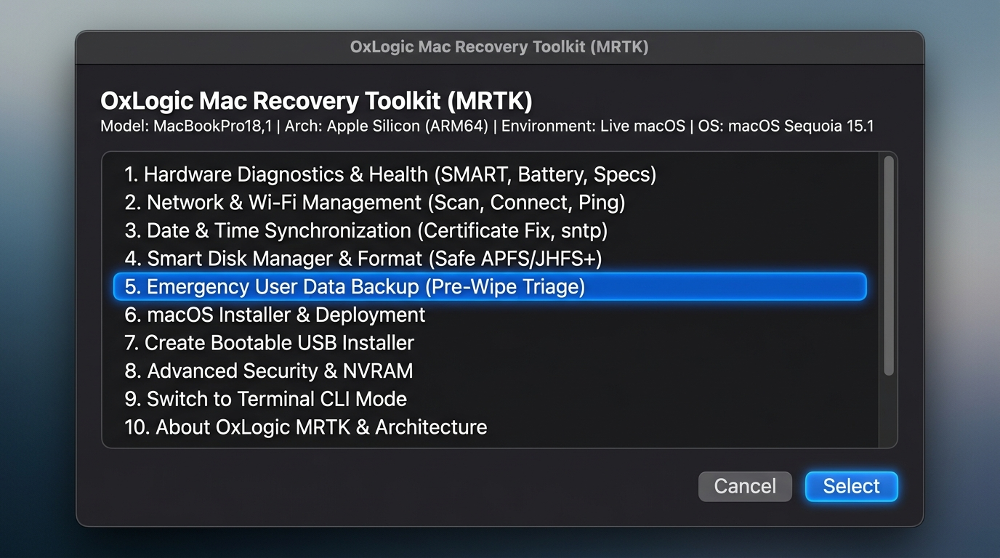
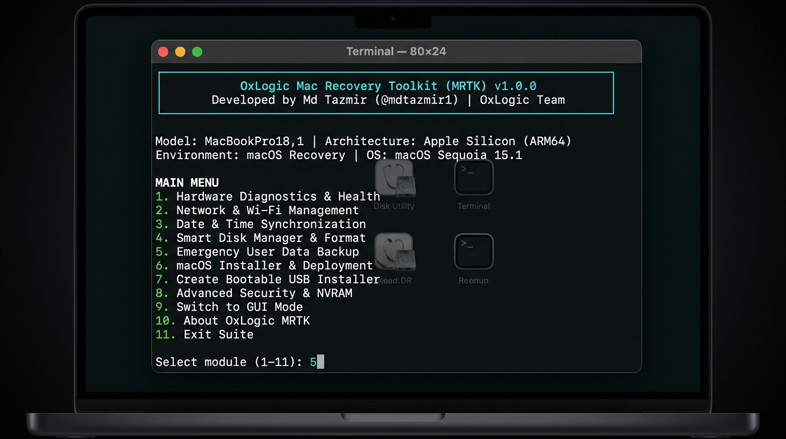

# 🍏 OxLogic Mac Recovery Toolkit (MRTK)

> **Official Repository:** [github.com/oxlogic/mac-recovery-toolkit](https://github.com/oxlogic/mac-recovery-toolkit)  
> **Lead Developer:** Md Tazmir ([GitHub](https://github.com/mdtazmir1) | [Facebook](https://www.facebook.com/muhammadtazmir)) | **Organization:** [OxLogic](https://github.com/oxlogic)  
> **License:** MIT License (Free for Technicians, Attribution Required)

A truly universal, future-proof, architecture-aware (Intel & Apple Silicon) macOS repair, hardware diagnostics, emergency pre-wipe data backup, automated OS deployment, and bootable USB creation suite. Fully operational in both **Live macOS (Desktop)** with Native AppleScript GUI and **macOS Recovery Mode** with an enterprise CLI terminal menu.

<p align="center">
  
  <br>
  <em>Figure 1: Native AppleScript Cocoa GUI Dialog Suite on macOS (Apple Silicon & Intel)</em>
</p>

> [!CAUTION]
> ### ⚠️ Legal Disclaimer & Limitation of Liability
> This software is provided **"AS IS"**, without warranty of any kind, express or implied. Disk formatting, partition management, NVRAM resetting, and OS deployment carry inherent risks of permanent data loss or hardware corruption. In no event shall the authors, contributors, or copyright holders (**Md Tazmir**, **OxLogic**) be liable for any claim, damages, data loss, hardware damage, business interruption, or financial loss arising from the use, misuse, or inability to use this toolkit. **Always verify and back up critical data before proceeding. You use this toolkit entirely at your own risk.**

[English Documentation](#-english-documentation) | [বাংলা ডকুমেন্টেশন](#-বাংলা-ডকুমেন্টেশন)

---

# 🌐 English Documentation

## 🚀 Quick Execution Guide

### 1. Live macOS (Normal Desktop Mode)
*When macOS is running normally:*

#### Method A: One-Click Double-Click (Zero Commands Required)
Simply double-click **`Launch_Mac_Recovery_Toolkit.command`** in Finder from your USB or Desktop!
> macOS will automatically open the Terminal and launch the native GUI suite without typing a single command.

#### Method B: Drag & Drop
1. Open Terminal (`Cmd + Space` ➔ type **Terminal** ➔ press **Enter**).
2. Type `bash ` (add a trailing space).
3. Drag and drop the `mac_recovery_toolkit.sh` file into the Terminal window and press **Enter**.

#### Method C: One-Liner via GitHub (No Download Required)
```bash
curl -sL https://raw.githubusercontent.com/oxlogic/mac-recovery-toolkit/main/mac_recovery_toolkit.sh | bash
```
> **Note:** On live macOS, this will automatically launch native, mouse-clickable **AppleScript GUI Dialog Windows & Buttons**.

---

### 2. macOS Recovery Mode
*When the Mac is unbootable or performing a clean install:*

#### Step 1: Boot into Recovery
* **Intel Macs:** Power on and immediately hold `Command + R` (or `Option/Alt` for boot menu).
* **Apple Silicon (M1/M2/M3/M4):** Press and hold the Power button for 10 seconds until *"Loading startup options"* appears, then select `Options`.

#### Step 2: Open Terminal
From the top menu bar, click: **Utilities** ➔ **Terminal**.

#### Step 3: Run from USB (Single Command):
```bash
bash /Volumes/*/mac_recovery_toolkit.sh
```
*(Or if you renamed the script to `mac.sh`: `bash /Volumes/*/mac.sh`)*

> **Note:** Apple restricts window rendering in Recovery root Terminal, so the suite automatically and safely falls back to a clean, menu-driven **CLI Terminal Menu**.

---

## 🛠️ Modules Overview (100% Dynamic & Universal)

| Module | Features & Capabilities |
| :--- | :--- |
| **1. Hardware Diagnostics** | Internal SSD SMART Status (Healthy vs Failing), Battery Health & Cycle Count, CPU & RAM overview. |
| **2. Network & Wi-Fi** | Scan nearby SSIDs, connect with password from CLI, ping Apple CDN (`time.apple.com`) and DNS (`1.1.1.1`). |
| **3. Date & Time Sync** | Bypass expired certificate errors (2016/2019 offline date fix) and sync via modern `sntp` / `ntpdate`. |
| **4. Smart Disk Manager** | Auto-detects internal SSDs vs external installer USBs. Safe APFS/JHFS+ formatting, First Aid, and **Quick Connect External USB / Hard Disk** (fixes slow exFAT/stuck drives). |
| **5. Emergency User Backup** | **(Pre-Wipe Triage)** Auto-detects internal `Macintosh HD - Data`, unlocks FileVault with password, and backs up user files via resumable `rsync` (excludes junk caches). |
| **6. macOS Deployment** | Auto-discovers `startosinstall` binaries on attached USBs; downloads full installers from Apple CDN. |
| **7. Create Bootable USB** | **(Live Mac)** 100% Dynamic - Auto-detects ANY macOS version (OS X Mavericks 10.9 to Sequoia 15, Tahoe 26, Golden Gate 27 & beyond). |
| **8. Security & Utilities** | Check SIP status (`csrutil`), reset Intel NVRAM (`nvram -c`), toggle verbose boot (`-v`), and check `bputil`. |
| **9. Switch Mode** | Switch between Native AppleScript GUI and Terminal CLI on demand. |
| **10. About OxLogic MRTK** | Architecture breakdown, system specifications, author credits, and license. |
| **11. Exit Suite** | Safe exit and cleanup. |

---

## 🏗️ Hybrid Dual-Engine Architecture
OxLogic MRTK utilizes an enterprise hybrid design for maximum flexibility:
* **Interactive Frontend GUI (Live macOS):** In normal macOS desktop mode, users are greeted with intuitive native Cocoa / AppleScript dialogs, lists, and button interfaces. No command memorization required.
* **Native Darwin Backend:** Behind every button click, the script directly executes verified, low-level macOS commands (`diskutil`, `gpt`, `rsync`, `sntp`, `scselect`, `nvram`, `bputil`, `createinstallmedia`).
* **Standalone CLI Terminal Mode (macOS Recovery):** In Recovery Mode or Single-User mode where WindowServer is restricted, the script automatically and gracefully runs as a high-speed, interactive terminal menu. Zero external dependencies (no Python, no Homebrew, no third-party binaries needed).

<p align="center">
  
  <br>
  <em>Figure 2: Standalone Zero-Dependency Terminal CLI Mode running in macOS Recovery</em>
</p>

---

## 🛡️ Complete Guide: How to Use Module 5 (Emergency User Data Backup)

Before erasing or re-installing macOS, you can safely extract customer files to an external USB flash drive or external hard drive. This engine works both on a running Mac and in macOS Recovery Mode when macOS cannot boot.

### 🖥️ Using GUI Mode (Live Mac Desktop):
1. **Launch Suite:** Double-click `Launch_Mac_Recovery_Toolkit.command` or run `bash mac_recovery_toolkit.sh`.
2. **Select Module 5:** Click **`5. Emergency User Data Backup (Pre-Wipe Triage)`**.
3. **Step 1 - Select User:** Click the customer's user account from the list.
4. **Step 2 - Select Destination Drive:** Select your connected external USB/HDD.
5. **Step 3 - Start Backup:** Click **`Start Backup`**.
   * Resumable `rsync` safely copies Desktop, Documents, Downloads, Pictures, and user files while automatically skipping system cache clutter (`Library/Caches`, `.Trash`).
   * A completion notification will pop up when backup finishes.

### ⌨️ Using CLI Mode (macOS Recovery Mode when Mac won't boot):
1. Boot Mac into **Recovery Mode** (`Cmd + R` on Intel, hold Power button on Apple Silicon).
2. Open **Terminal** from menu: **Utilities** ➔ **Terminal**.
3. Run: `bash /Volumes/*/mac_recovery_toolkit.sh`.
4. Choose option **`5`** from the main menu.
5. **FileVault Password:** If the internal drive is encrypted, type the Mac user login password when prompted to unlock `Macintosh HD - Data`.
6. Select the user number and target backup USB drive number.
7. Terminal displays live progress and stores files safely in a dated folder `Backup_<username>_<timestamp>/`.

---

## 💾 Complete Guide: How to Use Module 7 (Bootable USB Creator)

Creating a bootable macOS USB installer traditionally requires memorizing long, error-prone terminal commands like `sudo /Applications/.../createinstallmedia --volume ...`. **Module 7 automates this entire workflow dynamically for ANY macOS version past, present, and future.**

### 🖥️ Using GUI Mode (Live Mac Desktop):
1. **Launch Suite:** Run `universal_mac.sh` on your running Mac.
2. **Select Module 7:** Click on **`7. Create Bootable USB Installer`**.
3. **Step 1 - Select macOS Installer:**
   * The tool dynamically scans `/Applications`, `Downloads`, and `Desktop` for any installer apps (e.g. `Install macOS Sonoma.app`, `Install macOS Sequoia.app`, `Install macOS Tahoe.app`, etc.). Click your desired version from the list.
   * *Custom Location?* Click **`Browse manually...`** to open a native Finder file dialog and select any `.app` or `.dmg`.
   * *Selected a DMG?* The tool will automatically mount the DMG and extract the installer application inside.
4. **Step 2 - Select Target USB Drive:**
   * A clean list of connected **External USB flash drives** will appear (e.g., `SanDisk Ultra - 32 GB`).
   * *Safety Guard:* Internal SSDs and customer backup drives are strictly filtered out to prevent accidental data loss.
5. **Step 3 - Confirmation & Creation:**
   * Click **`Start Creating`**.
   * A native macOS authentication dialog will ask for your **Mac Administrator Password**.
   * The tool executes Apple's official `createinstallmedia` in the background.
   * *Duration:* Writing takes 10–25 minutes depending on USB speed. A completion dialog will notify you when it's ready: **"Bootable USB Created Successfully!"**.

### ⌨️ Using CLI Mode (Terminal):
1. Choose option **`7`** from the main terminal menu.
2. Pick your installer number from the discovered list (or type the path to `.app`).
3. Pick your USB flash drive number from the external disk list.
4. Type **`YES`** to confirm erasing the drive.
5. Enter your sudo password. The terminal will show the real-time writing percentage.

---

## ⚠️ Universal File System Format Rules
* **Format APFS (Option 2):** Required for **macOS High Sierra (10.13) through all modern and future macOS versions (Mojave, Catalina, Big Sur, Monterey, Ventura, Sonoma, Sequoia, Tahoe, Golden Gate & beyond)**. Modern macOS strictly requires APFS containers with Signed System Volumes (SSV).
* **Format JHFS+ / Journaled (Option 3):** Exclusively for legacy macOS versions (Sierra 10.12, El Capitan 10.11, Yosemite 10.10, Mavericks 10.9) or external data drives.

---
---

# 🇧🇩 বাংলা ডকুমেন্টেশন

> [!CAUTION]
> ### ⚠️ আইনি দায়মুক্তি ও সতর্কতা (Legal Disclaimer & Zero Liability)
> এই সফটওয়্যারটি সম্পূর্ণভাবে **"AS IS"** (যেভাবে আছে সেভাবে) সরবরাহ করা হয়েছে। ডিস্ক ফরম্যাটিং, ড্রাইভ পার্টিশন, ওএস ডিপ্লয়মেন্ট এবং সিস্টেম রিকভারি অত্যন্ত স্পর্শকাতর ও ঝুঁকিপূর্ণ টেকনিক্যাল কাজ। এই টুল বা স্ক্রিপ্ট ব্যবহারের ফলে কোনো ধরনের **ডেটা লস (Data Loss), হার্ডওয়্যার ড্যামেজ, সিস্টেম ক্র্যাশ বা আর্থিক ক্ষতির জন্য মূল ডেভেলপার (Md Tazmir) কিংবা OxLogic কোনোভাবেই দায়ী থাকবে না।** ব্যবহারকারী সম্পূর্ণ নিজ দায়িত্বে ও নিজ ঝুঁকিতে এটি ব্যবহার করবেন। যেকোনো ড্রাইভ ফরম্যাট করার আগে অবশ্যই প্রয়োজনীয় ডেটা ব্যাকআপ নিশ্চিত করুন।

## 🚀 দ্রুত ব্যবহারের নির্দেশিকা

### ১. লাইভ ম্যাক মোড (Live macOS / Desktop Mode)
*ম্যাক যখন স্বাভাবিকভাবে চালু থাকে:*

##### পদ্ধতি ১: ওয়ান-ক্লিক ডাবল-ক্লিক (কোনো কমান্ড টাইপ ছাড়া)
পেনড্রাইভ বা ফোল্ডার থেকে সরাসরি **`Launch_Mac_Recovery_Toolkit.command`** ফাইলটিতে ডাবল-ক্লিক করো!
> সাথে সাথে ম্যাক নিজে থেকেই টার্মিনাল চালু করবে এবং মাউস-ক্লিকযোগ্য আসল GUI মেনু খুলে দেবে। কোনো কমান্ড টাইপ করতে হবে না।

#### পদ্ধতি ২: সহজ ড্র্যাগ অ্যান্ড ড্রপ পদ্ধতি:
1. ম্যাকের টার্মিনাল খোলো (`Cmd + Space` চেপে **Terminal** লিখে Enter)।
2. টার্মিনালে লেখো `bash ` (একটা স্পেস দাও)।
3. `mac_recovery_toolkit.sh` ফাইলটিকে মাউস দিয়ে টেনে এনে টার্মিনালের ওপর ছেড়ে দাও এবং **Enter** চাপো।

#### গিটহাব থেকে সরাসরি ১ লাইনে রান (ডাউনলোড ছাড়া):
```bash
curl -sL https://raw.githubusercontent.com/oxlogic/mac-recovery-toolkit/main/mac_recovery_toolkit.sh | bash
```
> **নোট:** লাইভ ম্যাকে চালানোর সাথে সাথে স্ক্রিনে **মাউস-ক্লিকযোগ্য আসল GUI পপ-আপ উইন্ডো ও বাটন** ওপেন হবে।

---

### ২. রিকভারি মোড (macOS Recovery Mode)
*ম্যাক যখন অন হচ্ছে না বা নতুন ওএস ইনস্টল করতে হবে:*

#### স্টেপ ১: রিকভারিতে বুট করো
* **Intel Mac:** অন করার সাথে সাথে `Command + R` (অথবা বুট অপশনের জন্য `Option/Alt`) চেপে রাখো।
* **Apple Silicon (M1/M2/M3/M4):** পাওয়ার বাটন ১০ সেকেন্ড চেপে ধরে রাখো এবং `Options` সিলেক্ট করো।

#### স্টেপ ২: টার্মিনাল খোলো
 ওপরের মেনু বার থেকে: **Utilities** ➔ **Terminal**।

#### স্টেপ ৩: পেনড্রাইভ থেকে ১ লাইনে রান করো:
```bash
bash /Volumes/*/mac_recovery_toolkit.sh
```
*(অথবা যদি ফাইলের নাম `mac.sh` রেখে থাকো: `bash /Volumes/*/mac.sh`)*

> **নোট:** অ্যাপল রিকভারি মোডে টার্মিনাল থেকে উইন্ডো পপ-আপ ব্লক রাখে, তাই রিকভারিতে টুলটি স্বয়ংক্রিয়ভাবে একটি দ্রুত ও নিরাপদ **টার্মিনাল মেনু (CLI Mode)** হিসেবে চালু হবে।

---

## 🛠️ মডিউল পরিচিতি (১০০% ডাইনামিক ও ইউনিভার্সাল)

| মডিউল | কী কাজ করে? |
| :--- | :--- |
| **1. Hardware Diagnostics** | এসএসডি-র SMART হেলথ (ভালো নাকি নষ্ট), ব্যাটারি সাইকেল ও কন্ডিশন চেক করে। |
| **2. Network & Wi-Fi** | টার্মিনাল থেকেই ওয়াই-ফাই স্ক্যান, পাসওয়ার্ড দিয়ে কানেক্ট এবং অ্যাপল সার্ভার পিং টেস্ট। |
| **3. Date & Time Sync** | পুরোনো ওএসের সার্টিফিকেট এরর কাটাতে ২০১৬/২০১৯ ডেট ফিক্স এবং আধুনিক sntp সিঙ্ক। |
| **4. Smart Disk Manager** | ইন্টারনাল ও এক্সটার্নাল ড্রাইভ আলাদা করে দেখায়। নিরাপদ **APFS** বা **JHFS+** ফরম্যাট এবং আটকে থাকা ড্রাইভের জন্য **Quick Connect External USB / Hard Disk**। |
| **5. Emergency User Backup** | **(Pre-Wipe Triage)** ইন্টারনাল `Macintosh HD - Data` ডিটেক্ট করে, পাসওয়ার্ড দিয়ে FileVault ড্রাইভ আনলক করে এবং রেজুমেবল `rsync` দিয়ে নিরাপদ ব্যাকআপ নেয়। |
| **6. macOS Deployment** | পেনড্রাইভের ভেতর থাকা `startosinstall` স্বয়ংক্রিয়ভাবে খুঁজে ওএস ইনস্টল শুরু করে। |
| **7. Create Bootable USB** | **(লাইভ ম্যাক)** ১০০% ডাইনামিক - যেকোনো ওএস (Mavericks থেকে Sequoia, Tahoe, Golden Gate এবং ভবিষ্যতের সমস্ত ওএস)। |
| **8. Security & Utilities** | SIP স্ট্যাটাস, ইন্টেল ম্যাকের জন্য NVRAM রিসেট এবং ভার্বোজ বুট (-v) টগল। |
| **9. Switch Mode** | অ্যাপলস্ক্রিপ্ট GUI এবং টার্মিনাল CLI মোডের মধ্যে পরিবর্তন (লাইভ ডায়ালগ ⇄ টার্মিনাল)। |
| **10. About OxLogic MRTK** | আর্কিটেকচার পরিচিতি, সিস্টেম স্পেক্স, ডেভেলপার ক্রেডিট ও লাইসেন্স। |
| **11. Exit Suite** | কাজ শেষে নিরাপদে টার্মিনাল বা ডায়ালগ উইন্ডো বন্ধ করা। |

---

## 🏗️ হাইব্রিড ডুয়াল-ইঞ্জিন আর্কিটেকচার (GUI ও টার্মিনাল সিঙ্ক)
OxLogic MRTK সম্পূর্ণ ভিন্নধর্মী ও শক্তিশালী হাইব্রিড ডিজাইনে তৈরি:
* **মাউস-ক্লিকযোগ্য আসল GUI ফ্রন্টএন্ড (Live macOS):** চালু ম্যাক ডেক্সটপে এটি ব্যবহারকারীকে কোনো টার্মিনাল কমান্ড মুখস্থ রাখার ঝামেলা ছাড়াই আসল ম্যাকের পপ-আপ ডায়ালগ, বাটন ও ফাইল ব্রাউজার প্রদান করে।
* **ব্যাকএন্ড পাওয়ার (Native Terminal Commands):** প্রতিটা বাটনের ক্লিকে ব্যাকগ্রাউন্ডে শতভাগ নিখুঁত ও পরীক্ষিত ম্যাক টার্মিনাল কমান্ড (`diskutil`, `gpt`, `rsync`, `sntp`, `scselect`, `nvram`, `bputil`, `createinstallmedia`) স্বয়ংক্রিয়ভাবে রান করে।
* **জিরো-ডিপেন্ডেন্সি সরাসরি টার্মিনাল মোড (macOS Recovery):** ম্যাক রিকভারি মোড বা সিঙ্গেল-ইউজার মোডে যখন স্ক্রিনে গ্রাফিক্যাল উইন্ডো তৈরি সম্ভব হয় না, টুলটি স্বয়ংক্রিয়ভাবে একটি দ্রুত ও মেনু-চালিত **টার্মিনাল CLI মোড**-এ চলে যায়। এর জন্য কোনো পাইথন, হোমব্রিউ বা থার্ড-পার্টি ফাইলের দরকার নেই—পেনড্রাইভ থেকেই সরাসরি চলে।

<p align="center">
  
  <br>
  <em>চিত্র ২: ম্যাক রিকভারি মোডে টার্মিনাল সিএলআই ইন্টারফেস (Terminal CLI Mode)</em>
</p>

---

## 🛡️ পূর্ণাঙ্গ গাইড: মডিউল ৫ (ইমার্জেন্সি ইউজার ডাটা ব্যাকআপ) কীভাবে ব্যবহার করবে

ম্যাক ওএস ওয়াইপ, ফরম্যাট বা নতুন করে ডিপ্লয় করার আগে কাস্টমারের অমূল্য ফাইল কোনো ডাটা লস ছাড়া পেনড্রাইভ বা এক্সটার্নাল হার্ডডিস্কে ব্যাকআপ নেওয়ার নিয়ম:

### 🖥️ GUI মোডে ব্যবহারের নিয়ম (চালু ম্যাক ডেক্সটপ):
1. **টুল রান করো:** `Launch_Mac_Recovery_Toolkit.command` বা `mac_recovery_toolkit.sh` ডাবল-ক্লিক করো।
2. **মডিউল ৫ সিলেক্ট করো:** মাউস দিয়ে **`5. Emergency User Data Backup (Pre-Wipe Triage)`**-এ ক্লিক করো।
3. **ইউজার নির্বাচন:** ম্যাকের ইউজার একাউন্টগুলোর তালিকা আসবে (যেমন: `admin`), কাঙ্ক্ষিত ইউজারে ক্লিক করো।
4. **পেনড্রাইভ নির্বাচন:** ব্যাকআপ সেভ করার জন্য কানেক্টেড এক্সটার্নাল ইউএসবি বা হার্ডডিস্ক সিলেক্ট করো।
5. **Start Backup ক্লিক করো:** 
   - স্ক্রিপ্ট স্বয়ংক্রিয়ভাবে অকেজো ক্যাশ (`Library/Caches`, `.Trash`) বাদ দিয়ে আসল ফাইল ও ডকুমেন্টস কপি করবে।
   - কপি শেষ হলে স্ক্রিনে নোটিফিকেশন ভেসে উঠবে: **"Backup Successful!"**।

### ⌨️ CLI মোডে ব্যবহারের নিয়ম (রিকভারি মোড - যখন ম্যাক চালু হচ্ছে না):
1. ম্যাককে **রিকভারি মোডে** বুট করো (ইন্টেল ম্যাকে `Cmd + R`, অ্যাপল সিলিকন M1/M2/M3/M4-এ পাওয়ার বাটন চেপে ধরে রাখো)।
2. মেনু থেকে টার্মিনাল খোলো: **Utilities** ➔ **Terminal**।
3. কমান্ড চালাও: `bash /Volumes/*/mac_recovery_toolkit.sh`
4. মেইন মেনু থেকে **`5`** চেপে Enter দাও।
5. **পাসওয়ার্ড দিয়ে ড্রাইভ আনলক:** যদি কাস্টমারের ড্রাইভ FileVault এনক্রিপ্ট করা থাকে, স্ক্রিনে পাসওয়ার্ড চাইলে ম্যাক লগইন পাসওয়ার্ড দিয়ে Enter চাপো। সাথে সাথে ড্রাইভ আনলক হয়ে যাবে।
6. ইউজারের নম্বর এবং পেনড্রাইভের নম্বর সিলেক্ট করে দাও।
7. টার্মিনাল লাইভ প্রগ্রেস দেখিয়ে পেনড্রাইভে তারিখসহ ফোল্ডার আকারে (`Backup_username_তারিখ/`) সমস্ত ফাইল সেভ করে দেবে।

---

## 💾 পূর্ণাঙ্গ গাইড: মডিউল ৭ (বুটেবল পেনড্রাইভ মেকার) কীভাবে ব্যবহার করবে

টার্মিনালে বড় বড় কমান্ড (`sudo /Applications/.../createinstallmedia --volume ...`) মুখস্থ রাখা বা টাইপ করার দিন শেষ। **মডিউল ৭ যেকোনো ওএসের জন্য সম্পূর্ণ স্বয়ংক্রিয়ভাবে বুটেবল পেনড্রাইভ তৈরি করে।**

### 🖥️ GUI মোডে ব্যবহারের নিয়ম (চালু ম্যাক ডেক্সটপ):
1. **টুল রান করো:** চালু ম্যাকে `universal_mac.sh` রান করো।
2. **মডিউল ৭ সিলেক্ট করো:** মাউস দিয়ে **`7. Create Bootable USB Installer`**-এ ক্লিক করো।
3. **স্টেপ ১ - ওএস ফাইল সিলেক্ট:**
   * স্ক্রিপ্ট নিজে থেকেই Applications, Downloads ও Desktop ফোল্ডার স্ক্যান করে যেকোনো ওএস ফাইল স্বয়ংক্রিয়ভাবে খুঁজে দেখাবে (যেমন: Sonoma, Sequoia, Tahoe বা যেকোনো নতুন ওএস)। মাউস দিয়ে তোমার ওএসটিতে ক্লিক করো।
   * *অন্য কোনো ফোল্ডারে ওএস ফাইল আছে?* সোজা **`Browse manually...`**-তে ক্লিক করো। ম্যাকের আসল ফাইল পিকার উইন্ডো খুলে যাবে, যেকোনো `.app` বা `.dmg` সিলেক্ট করে দাও।
   * *DMG ফাইল সিলেক্ট করলে:* স্ক্রিপ্ট স্বয়ংক্রিয়ভাবে ব্যাকগ্রাউন্ডে DMG মাউন্ট করে ভেতরের ইনস্টলার খুঁজে নেবে।
4. **স্টেপ ২ - পেনড্রাইভ সিলেক্ট:**
   * শুধুমাত্র কানেক্টেড **External USB Flash Drive**-গুলোর তালিকা আসবে (যেমন: `SanDisk Ultra - 32 GB`)। মাউস দিয়ে পেনড্রাইভে ক্লিক করো।
   * *সেফটি প্রটেকশন:* ইন্টারনাল এসএসডি বা কোনো ব্যাকআপ হার্ডডিস্ক কখনোই লিস্টে আসবে না (১০০% ডাটা সুরক্ষিত)।
5. **স্টেপ ৩ - কনফার্মেশন ও বুটেবল তৈরি:**
   * মাউস দিয়ে **`Start Creating`** বাটনে ক্লিক করো।
   * ম্যাকের আসল অ্যাডমিন পাসওয়ার্ড ডায়ালগ আসবে, পাসওয়ার্ড দিয়ে OK করো।
   * স্ক্রিপ্ট ব্যাকগ্রাউন্ডে অ্যাপলের অফিশিয়াল `createinstallmedia` রান করবে।
   * *সময়কাল:* ইউএসবি স্পিড অনুযায়ী ১০–২৫ মিনিট সময় লাগবে। তৈরি শেষ হলে স্ক্রিনে বড় সাকসেস নোটিফিকেশন ভেসে উঠবে: **"Bootable USB Created Successfully!"**।

### ⌨️ CLI মোডে ব্যবহারের নিয়ম (টার্মিনাল মেনু):
1. মেইন মেনু থেকে **`7`** চেপে Enter দাও।
2. ইনস্টলারের তালিকা থেকে নম্বর সিলেক্ট করো (অথবা পাথের নাম পেস্ট করো)।
3. ইউএসবি ড্রাইভের তালিকা থেকে পেনড্রাইভের নম্বরটি বেছে নাও।
4. কনফার্মেশনের জন্য **`YES`** লিখে Enter দাও।
5. অ্যাডমিন পাসওয়ার্ড দিলেই টার্মিনালে সরাসরি পার্সেন্টেজ (0%... 10%... 100%) সহ পেনড্রাইভ তৈরি শুরু হয়ে যাবে।

---

## ⚠️ ইউনিভার্সাল ফাইল সিস্টেম ফরম্যাট রুলস
* **Format APFS (Option 2):** macOS High Sierra (10.13) থেকে শুরু করে **ভবিষ্যতের সমস্ত আধুনিক ওএস (Mojave, Catalina, Big Sur, Monterey, Ventura, Sonoma, Sequoia, Tahoe, Golden Gate এবং তার পরের সমস্ত ওএস)**। কারণ আধুনিক ম্যাক ওএসে অ্যাপল Signed System Volume (SSV) এবং APFS স্ন্যাপশট ছাড়া বুট হতে দেয় না।
* **Format JHFS+ / Journaled (Option 3):** শুধুমাত্র পুরোনো লিগ্যাসি ওএস (Sierra 10.12, El Capitan 10.11, Yosemite 10.10, Mavericks 10.9) অথবা সাধারণ এক্সটার্নাল স্টোরেজ ড্রাইভের জন্য।

---

## 👨‍💻 লেখক ও কমিউনিটি (Author & Community)
* **মূল নির্মাতা (Lead Developer):** [Md Tazmir](https://www.facebook.com/muhammadtazmir)
* **গিটহাব প্রোফাইল:** [@mdtazmir1](https://github.com/mdtazmir1)
* **অফিসিয়াল অর্গানাইজেশন:** [OxLogic](https://github.com/oxlogic)
* **ফেসবুক যোগাযোগ:** [fb.com/muhammadtazmir](https://www.facebook.com/muhammadtazmir)
* **লাইসেন্স:** MIT License (সবার জন্য ফ্রি ও উন্মুক্ত)
